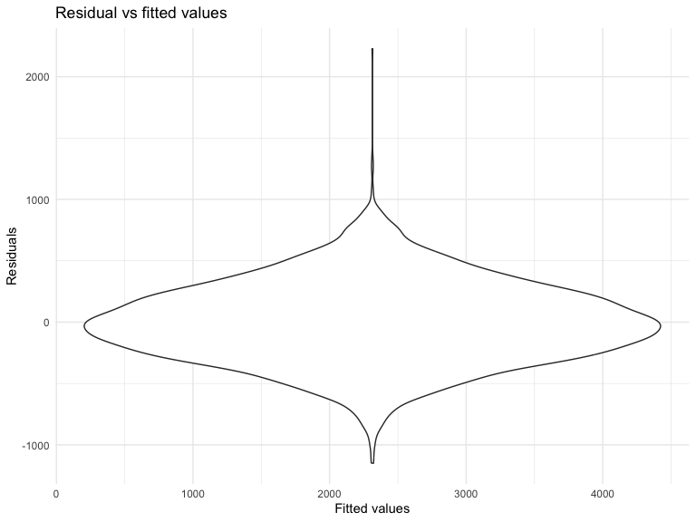

Homework 6
================
Youssra Yemmas
2023-12-02

## Homework 6

This “problem” focuses on structure of your assignment, including the
use of R Markdown to write reproducible reports, the use of R Projects
to organize your work, the use of relative paths to load data, and the
naming structure for your files.

To that end:

- create a public GitHub repo + local R Project for this assignment
- write solutions using a .Rmd file that outputs a `github_document` /
  .md file
- submit a link to your repo via Courseworks

Your solutions to Problems 1 and 2 should be implemented in your .Rmd
file, and your git commit history should reflect the process you used to
solve these Problems.

For Problem 0, we will assess adherence to the instructions above
regarding repo structure, git commit history, and whether we are able to
knit your .Rmd to ensure that your work is reproducible. Adherence to
appropriate styling and clarity of code will be assessed in Problems 1+
using the homework [style rubric](homework_style_rubric.html).

This homework includes figures; the readability of your embedded plots
(e.g. font sizes, axis labels, titles) will be assessed in Problems 1+.

``` r
library(tidyverse)
library(modelr)
library(broom)
```

    ## 
    ## Attaching package: 'broom'

    ## The following object is masked from 'package:modelr':
    ## 
    ##     bootstrap

``` r
library(purrr)
library(ggplot2)
```

### Problem 1

In the data cleaning code below we create a `city_state` variable,
change `victim_age` to numeric, modifiy victim_race to have categories
white and non-white, with white as the reference category, and create a
`resolution` variable indicating whether the homicide is solved. Lastly,
we filtered out the following cities: Tulsa, AL; Dallas, TX; Phoenix,
AZ; and Kansas City, MO; and we retained only the variables
`city_state`, `resolution`, `victim_age`, `victim_sex`, and
`victim_race`.

``` r
homicide_df = 
  read_csv("data/homicide-data.csv", na = c("", "NA", "Unknown")) |> 
  mutate(
    city_state = str_c(city, state, sep = ", "),
    victim_age = as.numeric(victim_age),
    resolution = case_when(
      disposition == "Closed without arrest" ~ 0,
      disposition == "Open/No arrest"        ~ 0,
      disposition == "Closed by arrest"      ~ 1)
  ) |> 
  filter(victim_race %in% c("White", "Black")) |> 
  filter(!(city_state %in% c("Tulsa, AL", "Dallas, TX", "Phoenix, AZ", "Kansas City, MO"))) |> 
  select(city_state, resolution, victim_age, victim_sex, victim_race)
```

    ## Rows: 52179 Columns: 12
    ## ── Column specification ────────────────────────────────────────────────────────
    ## Delimiter: ","
    ## chr (8): uid, victim_last, victim_first, victim_race, victim_sex, city, stat...
    ## dbl (4): reported_date, victim_age, lat, lon
    ## 
    ## ℹ Use `spec()` to retrieve the full column specification for this data.
    ## ℹ Specify the column types or set `show_col_types = FALSE` to quiet this message.

Next we fit a logistic regression model using only data from Baltimore,
MD. We model `resolved` as the outcome and `victim_age`, `victim_sex`,
and `victim_race` as predictors. We save the output as `baltimore_glm`
so that we can apply `broom::tidy` to this object and obtain the
estimate and confidence interval of the adjusted odds ratio for solving
homicides comparing non-white victims to white victims.

``` r
baltimore_glm = 
  filter(homicide_df, city_state == "Baltimore, MD") |> 
  glm(resolution ~ victim_age + victim_sex + victim_race, family = binomial(), data = _)

baltimore_glm |> 
  broom::tidy() |> 
  mutate(
    OR = exp(estimate), 
    OR_CI_upper = exp(estimate + 1.96 * std.error),
    OR_CI_lower = exp(estimate - 1.96 * std.error)) |> 
  filter(term == "victim_sexMale") |> 
  select(OR, OR_CI_lower, OR_CI_upper) |>
  knitr::kable(digits = 3)
```

|    OR | OR_CI_lower | OR_CI_upper |
|------:|------------:|------------:|
| 0.426 |       0.325 |       0.558 |

Below, by incorporating `nest()`, `map()`, and `unnest()` into the
preceding Baltimore-specific code, we fit a model for each of the
cities, and extract the adjusted odds ratio (and CI) for solving
homicides comparing non-white victims to white victims. We show the
first 5 rows of the resulting dataframe of model results.

``` r
model_results = 
  homicide_df |> 
  nest(data = -city_state) |> 
  mutate(
    models = map(data, \(df) glm(resolution ~ victim_age + victim_sex + victim_race, 
                             family = binomial(), data = df)),
    tidy_models = map(models, broom::tidy)) |> 
  select(-models, -data) |> 
  unnest(cols = tidy_models) |> 
  mutate(
    OR = exp(estimate), 
    OR_CI_upper = exp(estimate + 1.96 * std.error),
    OR_CI_lower = exp(estimate - 1.96 * std.error)) |> 
  filter(term == "victim_sexMale") |> 
  select(city_state, OR, OR_CI_lower, OR_CI_upper)

model_results |>
  slice(1:5) |> 
  knitr::kable(digits = 3)
```

| city_state      |    OR | OR_CI_lower | OR_CI_upper |
|:----------------|------:|------------:|------------:|
| Albuquerque, NM | 1.767 |       0.831 |       3.761 |
| Atlanta, GA     | 1.000 |       0.684 |       1.463 |
| Baltimore, MD   | 0.426 |       0.325 |       0.558 |
| Baton Rouge, LA | 0.381 |       0.209 |       0.695 |
| Birmingham, AL  | 0.870 |       0.574 |       1.318 |

``` r
model_results |> 
  mutate(city_state = fct_reorder(city_state, OR)) |> 
  ggplot(aes(x = city_state, y = OR)) + 
  geom_point() + 
  geom_errorbar(aes(ymin = OR_CI_lower, ymax = OR_CI_upper)) + 
  theme(axis.text.x = element_text(angle = 90, hjust = 1))
```


This is a plot of the estimated ORs and CIs for each city, ordered by
magnitude of the OR from smallest to largest. From this plot we see that
most cities have odds ratios that are smaller than 1, suggesting that
crimes with male victims have smaller odds of resolution compared to
crimes with female victims after adjusting for victim age and race. This
disparity is strongest in New York. In roughly half of these cities,
confidence intervals are narrow and do not contain 1, suggesting a
significant difference in resolution rates by sex after adjustment for
victim age and race.

### Problem 2

For this problem I will need the Central Park dataset so I will load
that in the below chunk

``` r
weather_df = 
  rnoaa::meteo_pull_monitors(
    c("USW00094728"),
    var = c("PRCP", "TMIN", "TMAX"), 
    date_min = "2022-01-01",
    date_max = "2022-12-31") |>
  mutate(
    name = recode(id, USW00094728 = "CentralPark_NY"),
    tmin = tmin / 10,
    tmax = tmax / 10) |>
  select(name, id, everything())
```

    ## using cached file: /Users/youssrayemmas/Library/Caches/org.R-project.R/R/rnoaa/noaa_ghcnd/USW00094728.dly

    ## date created (size, mb): 2023-09-23 14:44:56.83037 (8.525)

    ## file min/max dates: 1869-01-01 / 2023-09-30

The boostrap is helpful when you’d like to perform inference for a
parameter / value / summary that doesn’t have an easy-to-write-down
distribution in the usual repeated sampling framework. We’ll focus on a
simple linear regression with tmax as the response with tmin and prcp as
the predictors, and are interested in the distribution of two quantities
estimated from these data:

r̂2 log(β̂1∗β̂2) Use 5000 bootstrap samples and, for each bootstrap sample,
produce estimates of these two quantities. Plot the distribution of your
estimates, and describe these in words. Using the 5000 bootstrap
estimates, identify the 2.5% and 97.5% quantiles to provide a 95%
confidence interval for r̂2 and log(β̂0∗β̂1). Note: broom::glance() is
helpful for extracting r̂2 from a fitted regression, and broom::tidy()
(with some additional wrangling) should help in computing log(β̂1∗β̂2).

).

``` r
# first I will fit the model 
slr = lm(tmax ~ tmin + prcp, data = weather_df)
   broom::tidy(slr)
```

    ## # A tibble: 3 × 5
    ##   term        estimate std.error statistic   p.value
    ##   <chr>          <dbl>     <dbl>     <dbl>     <dbl>
    ## 1 (Intercept)  8.04      0.230      35.0   4.39e-118
    ## 2 tmin         1.01      0.0162     62.7   1.43e-196
    ## 3 prcp        -0.00154   0.00210    -0.733 4.64e-  1

``` r
   broom::glance(slr)
```

    ## # A tibble: 1 × 12
    ##   r.squared adj.r.squared sigma statistic   p.value    df logLik   AIC   BIC
    ##       <dbl>         <dbl> <dbl>     <dbl>     <dbl> <dbl>  <dbl> <dbl> <dbl>
    ## 1     0.916         0.915  2.96     1972. 2.19e-195     2  -912. 1832. 1848.
    ## # ℹ 3 more variables: deviance <dbl>, df.residual <int>, nobs <int>

``` r
 # then I am going to use 5000 bootstrap samples to make estimates of certain quantities I am interested in
  bootstrap_df =   
  weather_df %>% 
  modelr::bootstrap(n = 5000) %>% 
  mutate(
    models = map(strap, \(df) lm(tmax ~ tmin + prcp, data = df)),
    results = map(models, broom::tidy),
    results2 = map(models, broom::glance)) %>% 
  select(results, results2) %>% 
  unnest(results2) %>% 
  select(r.squared, results) %>% 
  unnest(results)  %>% 
  select(term, estimate, r.squared)  %>% 
  group_by(term)  %>% 
  mutate(group_id = ceiling((row_number() )))  %>% 
  ungroup()  %>% 
  pivot_wider(
    names_from = term,
    values_from = estimate,
  )  %>% 
  mutate(log_beta = log(tmin * abs(prcp)))
  
# I want to identify and clearly display the 1st and 3rd quantiles
  r_squared_ci <- quantile(bootstrap_df$r.squared, c(0.025, 0.975))

log_beta_ci <- quantile(bootstrap_df$log_beta, c(0.025, 0.975))

knitr::kable(r_squared_ci)
```

|       |         x |
|:------|----------:|
| 2.5%  | 0.8891891 |
| 97.5% | 0.9403245 |

``` r
knitr::kable(log_beta_ci)
```

|       |         x |
|:------|----------:|
| 2.5%  | -8.665626 |
| 97.5% | -4.598601 |

The 2.5% and 97.5% quantiles of the R-squared estimate is -8.64 and
-4.59 resprectively and the same quantiles for the log beta1\*beta2 is
0.89 and 0.94 respectively.

### Problem 2 cont- plotting the estimates

``` r
bootstrap_df |>
  ggplot(aes(x = log_beta)) + 
  geom_density() +
  labs(
    title = "Distribution of log(beta_1 * beta_2)",
    x = "log(beta_1 * beta_2)",
    y = "Density"
  )
```


``` r
bootstrap_df |>
  ggplot(aes(x = r.squared)) + 
  geom_density() +
    labs(
    title = "Distribution of R squared",
    x = "R squared",
    y = "Density"
  )
```


The distribution of the log of beta1\*beta2 is skewed to the left and
the distribution of r.squared appears mostly normal if not with a slight
left skew but not as drastically as the log distribution. The curve for
the r.squared is more smooth than than of log which means that for the
r.squared distribution the bootstrapping worked better.

### Problem 3

In this problem, you will analyze data gathered to understand the
effects of several variables on a child’s birthweight. This dataset,
available here, consists of roughly 4000 children and includes the
following variables:

babysex: baby’s sex (male = 1, female = 2) bhead: baby’s head
circumference at birth (centimeters) blength: baby’s length at birth
(centimeteres) bwt: baby’s birth weight (grams) delwt: mother’s weight
at delivery (pounds) fincome: family monthly income (in hundreds,
rounded) frace: father’s race (1 = White, 2 = Black, 3 = Asian, 4 =
Puerto Rican, 8 = Other, 9 = Unknown) gaweeks: gestational age in weeks
malform: presence of malformations that could affect weight (0 = absent,
1 = present) menarche: mother’s age at menarche (years) mheigth:
mother’s height (inches) momage: mother’s age at delivery (years) mrace:
mother’s race (1 = White, 2 = Black, 3 = Asian, 4 = Puerto Rican, 8 =
Other) parity: number of live births prior to this pregnancy pnumlbw:
previous number of low birth weight babies pnumgsa: number of prior
small for gestational age babies ppbmi: mother’s pre-pregnancy BMI ppwt:
mother’s pre-pregnancy weight (pounds) smoken: average number of
cigarettes smoked per day during pregnancy wtgain: mother’s weight gain
during pregnancy (pounds) Load and clean the data for regression
analysis (i.e. convert numeric to factor where appropriate, check for
missing data, etc.).

Propose a regression model for birthweight. This model may be based on a
hypothesized structure for the factors that underly birthweight, on a
data-driven model-building process, or a combination of the two.
Describe your modeling process and show a plot of model residuals
against fitted values – use add_predictions and add_residuals in making
this plot.

Compare your model to two others:

One using length at birth and gestational age as predictors (main
effects only) One using head circumference, length, sex, and all
interactions (including the three-way interaction) between these Make
this comparison in terms of the cross-validated prediction error; use
crossv_mc and functions in purrr as appropriate.

Note that although we expect your model to be reasonable, model building
itself is not a main idea of the course and we don’t necessarily expect
your model to be “optimal”.

``` r
#Trying to fit a model that gives a good prediction of birthweight. From my own experience seeing all the important numbers at family births it would seem like babys head circumference, gestational age in weeks, babys sex, and mothers weight gain during pregancy would be important factors 

hypothesized_fit =
  lm(bwt ~ babysex+bhead+gaweeks+wtgain, data = birthweight_df) 
```

``` r
#Tidying up my hypothesized model
hypothesized_fit %>% 
  broom::glance()
```

    ## # A tibble: 1 × 12
    ##   r.squared adj.r.squared sigma statistic p.value    df  logLik    AIC    BIC
    ##       <dbl>         <dbl> <dbl>     <dbl>   <dbl> <dbl>   <dbl>  <dbl>  <dbl>
    ## 1     0.589         0.588  329.     1551.       0     4 -31320. 62653. 62691.
    ## # ℹ 3 more variables: deviance <dbl>, df.residual <int>, nobs <int>

``` r
hypothesized_fit %>% 
  broom::tidy() %>% 
  select(term, estimate, p.value) %>% 
  knitr::kable(digits = 3)
```

| term        |  estimate | p.value |
|:------------|----------:|--------:|
| (Intercept) | -5132.224 |   0.000 |
| babysex2    |    29.367 |   0.004 |
| bhead       |   215.079 |   0.000 |
| gaweeks     |    22.536 |   0.000 |
| wtgain      |     4.812 |   0.000 |

``` r
# I am going to add residuals and fitted values and then visualized my model so that I can best compare it
birthweight_df %>%  
  select(bwt, babysex, bhead, gaweeks, wtgain) %>% 
  modelr::add_residuals(hypothesized_fit) %>% 
  modelr::add_predictions(hypothesized_fit)  %>% 
  ggplot(aes(x = pred, y = resid)) +
  geom_violin() +
  labs(
    title = "Residual vs fitted values",
    x = "Fitted values",
    y = "Residuals"
  )
```



### Problem 3 cont.- setting up the comparison models

``` r
# This model uses baby length and gestational age in weeks as predictors

model1_fit = 
  lm(bwt ~ blength + gaweeks, data = birthweight_df)

# This model uses head circumference, length, sex, and all interactions (including the three-way interaction) between these

model3_fit = 
  lm(bwt ~ bhead + blength + babysex + bhead*blength*babysex, data = birthweight_df)
```

Now I want to compare all three models usiong cross validated prediction
error

``` r
library(modelr)
cv_df =
  crossv_mc(birthweight_df, 100)  %>% 
  mutate(
    train = map(train, as_tibble),
    test = map(test, as_tibble)) %>% 
  mutate(
    hypothesized_fit = map(train, \(df) lm(bwt ~ babysex+bhead+gaweeks+wtgain, data = birthweight_df)),
    model1_fit = map(train, \(df) lm(bwt ~ blength + gaweeks, data = birthweight_df)),
    model2_fit = map(train, \(df) lm(bwt ~ bhead + blength + babysex + bhead*blength + bhead*babysex + blength*babysex, data = birthweight_df)) 
  ) %>%  
  mutate(
    rmse_1 = map2_dbl(hypothesized_fit, test, \(mod, df) rmse(model = mod, data = birthweight_df)),
    rmse_2 = map2_dbl(model1_fit, test, \(mod, df) rmse(model = mod, data = birthweight_df)),
    rmse_3 = map2_dbl(model2_fit, test, \(mod, df) rmse(model = mod, data = birthweight_df))
  ) 

cv_df  %>% 
  select(starts_with("rmse"))  %>%  
  pivot_longer(
    everything(),
    names_to = "model", 
    values_to = "rmse",
    names_prefix = "rmse_") %>% 
  mutate(model = fct_inorder(model)) %>% 
  ggplot(aes(x = model, y = rmse)) + 
  geom_violin() +
  labs(
    title = "Prediction error distribution of each model",
    x = "Model",
    y = "RMSE"
  )
```


I do not think my plot is working but it seems that model 1 and model 2
which is my hypothesized model and the model with less predictors are
better than the model that has the interaction terms.
